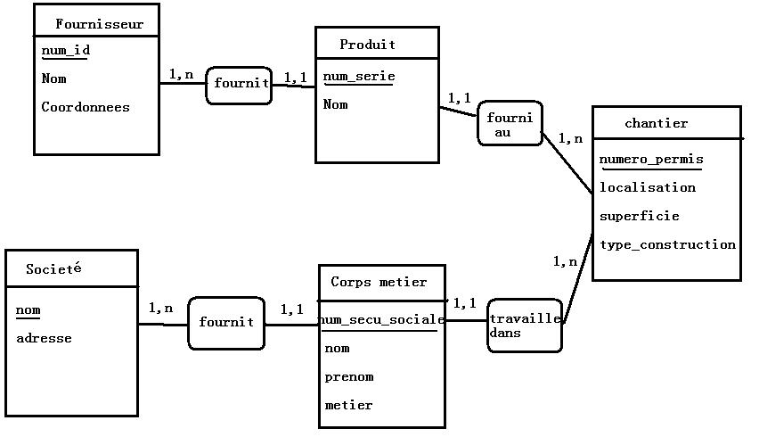

# MySQL

Un Système de Gestion de Bases de Données Relationnelles (SGBDR) comme MySQL (ou Oracle, PostgreSQL, SQL Server, Access, Filemaker, DB2) permet de stocker des gros volumes de données tout en restant performant.

On peut se représenter les données sous la forme d'un tableau, mais contrairement à Excel par exemple les données ne sont pas stocké à une position précise (Excel : ligne 3 colonne B).


## SQL

Langage qui permet de communiquer avec une base de données relationnelle.

### Insertion

```SQL
INSERT INTO nom_table (nom_colonne, nom_autre_colonne)
VALUES ('Valeur de la col 1', 'Val col 2')
```

### Lecture

Récupérer tous les enregistrements

```SQL
SELECT nom_colonne, nom_autre_colonne
FROM nom_table
```

On peut aussi écrire toutes les colonnes avec * 

```SQL
SELECT *
FROM nom_table
```

Pour trier on ajoute une clause ORDER BY

```SQL
SELECT nom_colonne, nom_autre_colonne
FROM nom_table
ORDER BY nom_colonne
```

On peut aussi trier de manière décroissante

```SQL
SELECT nom_colonne, nom_autre_colonne
FROM nom_table
ORDER BY nom_colonne DESC
```

On peut aussi trier avec plusieurs critères

```SQL
SELECT nom_colonne, nom_autre_colonne
FROM nom_table
ORDER BY nom_colonne, nom_autre_colonne
```

Pour limiter le nombre d'enregistrement on utilise la clause LIMIT (attention LIMIT n'est pas standard, ex n'existe pas sous ORACLE)

```SQL
SELECT nom_colonne, nom_autre_colonne
FROM nom_table
LIMIT nb_enregistrement
```

Bonne pratique : toujours mettre une clause LIMIT (en production pas de LIMIT peut faire tomber un serveur)

On peut cumuler avec les autres clause :

```SQL
SELECT nom_colonne, nom_autre_colonne
FROM nom_table
ORDER BY nom_colonne
LIMIT nb_enregistrement
```

On peut aussi ajouter un décalage :
```SQL
SELECT nom_colonne, nom_autre_colonne
FROM nom_table
LIMIT nb_enregistrement, decalage
```

Ex : On veut la page 3 de voiture (10 enregistrements à partir du 20e)
```SQL
SELECT marque, modele
FROM voiture
LIMIT 10, 20
```

Filtrer par critères
```SQL
SELECT nom_colonne, nom_autre_colonne
FROM nom_table
WHERE criteres
```

Ex : toutes les voitures de marques Renault
```SQL
SELECT marque, modele
FROM voiture
WHERE marque = 'Renault'
```

Il existe plein d'opérateurs :

* `=`
* `!=` ou `<>`
* `>`, `>=`, `<`, `<=`
* `BETWEEN valeur AND autre_valeur`
* `LIKE 'R*'` (tout ce qui commence par R)

L'ordre est important : SELECT, FROM, WHERE, ORDER BY, LIMIT

Au final :

```SQL
SELECT marque, modele
FROM voiture
WHERE marque = 'Renault'
ORDER BY modele
LIMIT 10
```

### Suppression

```SQL
DELETE FROM nom_table
WHERE criteres
```

Ex :
```SQL
DELETE FROM voiture
WHERE id = 3
```

### Modification

```SQL
UPDATE nom_table
SET nom_colonne = 'nouvelle valeur', nom_autre_colonne = 'autre valeur'
WHERE criteres
```

Ex :
```SQL
UPDATE voiture
SET marque = 'Renault'
WHERE id = 1
```

## Conception de base de données

### Cardinalité

Entre 2 tables on peut retrouver 3 types de relations :

* 1..1 (pour un enregistrement d'une table on a maximum un enregistrement dans l'autre et inversement 1 maximum)
* 1..n (pour un enregistrement d'une table on a maximum plusieurs dans l'autre et inversement 1 maximum)
* n..m (pour un enregistrement d'une table on a maximum plusieurs dans l'autre et inversement plusieurs maximum)

Exemple relations dans une famille :

En France et à un instant t

Homme et Femme (relation mariage) : 
Un homme peut avoir entre 0 et 1 femme.
Une femme peut avoir entre 0 et 1 mari.
Donc relation 1..1

Femme et Enfant (relation maternité) :
Une femme peut avoir entre 0 et n enfants.
Un enfant peut avoir entre 1 et 1 mère.
Donc relation 1..n

Frères/soeurs et frères/soeurs :
Un enfant peut avoir entre 0 et n frères/soeurs.
Un frères/soeurs peut entre 0 et n frères/soeurs.
Donc relation n..m

### Schéma Entité/association

Entité : regroupement de données

Le schéma entité association présente les liens des entités et leurs cardinalité.



### Passage au schéma physique (aux tables)

#### Relation 1..n

Côté n (où potentiellement il y aura le plus d'enregistrements), on ajoute une colonne qui reproduira la valeur de la clé primaire de l'enregistrement à lier (on parle de clé étrangère (Foreign Key)).

##### Exemple :

Un contact peut travailler dans 0 ou 1 société. Une société peut contenir entre 0 et n contacts.

*Société*

| id | nom | site_web |
|----|-----|----------|
| 2 |	Facebook |	www.facebook.com |
| 5	| Apple | www.apple.com |
| 18 | Microsoft| www.microsoft.com |

*Contact*

| id | prenom | nom | societe_id |
|----|-----|----------|---------|
| 1 |	Steve | Jobs | 5 |
| 2	| Bill | Gates | 18 |
| 4 | Mark | Zuckerberg | 2 |
| 53 | Steve | Ballmer | 18 |
| 100 | Romain | Bohdanowicz | NULL |

#### Relation n..m

On doit créer une nouvelle table qui contiendra les liens.

##### Exemple :

*Contact*

| id | prenom | nom |
|----|-----|----------|
| 1 |	Steve | Jobs |
| 2	| Bill | Gates |
| 4 | Mark | Zuckerberg |
| 53 | Steve | Ballmer |
| 100 | Romain | Bohdanowicz |

*Groupe*

| id | nom | description |
|----|-----|----------|
| 23 |	Amis | ... |
| 52 | Famille | ... |
| 12 | Sport | ... |
| 60 | Travail | ... |

*Table de liens groupe_contact*

| groupe_id| contact_id| 
|----|----- |
| 23| 1 | 
| 60| 1 | 
| 23| 4 | 
| 12| 100 | 
| 60| 56 | 

Si le lien ne peut se faire qu'une seule fois, la clé primaire de cette table est l'ensemble groupe_id+contact_id. Sinon on ajoute une clé primaire id.


#### Relation 1..1

Exemple :

Un membre est associé à sa fiche contact (profil), un contact peut être membre.

*Contact*

| id | prenom | nom |
|----|-----|----------|
| 1 |	Steve | Jobs |
| 2	| Bill | Gates |
| 4 | Mark | Zuckerberg |
| 53 | Steve | Ballmer |
| 100 | Romain | Bohdanowicz |

*Membre*

| id | login | pass |
|----|-----|----------|
| 12 |	admin | password |
| 34 | user | 1234 |

##### 4 possibités

##### Solution 1 : Fusionner les tables

*Contact*

| id | prenom | nom | login | pass |
|----|--------|-----|-------|------|
| 1 |	Steve | Jobs | NULL | NULL |
| 2	| Bill | Gates | NULL | NULL |
| 4 | Mark | Zuckerberg | user | 1234 |
| 53 | Steve | Ballmer | NULL | NULL |
| 100 | Romain | Bohdanowicz | admin | password |

###### Avantages

1 seule tables donc pas de jointure (SQL)

###### Inconvénients

Un peu moins efficaces en terme de stockage et donc de performance

##### Solution 2 : Maintenir des clés primaires identiques

*Contact*

| id | prenom | nom |
|----|-----|----------|
| 1 |	Steve | Jobs |
| 2	| Bill | Gates |
| 4 | Mark | Zuckerberg |
| 53 | Steve | Ballmer |
| 100 | Romain | Bohdanowicz |

*Membre*

| id | login | pass |
|----|-----|----------|
| 100 |	admin | password |
| 4 | user | 1234 |

Dans membre id est à la fois clé primaire et clé étrangère (il vaudrait mieux faire l'inverse comme ça membre est indépendement et peut être réutilisée pour un autre projet)

###### Avantages

Pas de trous

###### Inconvénients

Jointures, difficile à coder.

##### Solution 3 : On ajoute une colonne d'un côté

*Contact*

| id | prenom | nom |
|----|-----|----------|
| 1 |	Steve | Jobs |
| 2	| Bill | Gates |
| 4 | Mark | Zuckerberg |
| 53 | Steve | Ballmer |
| 100 | Romain | Bohdanowicz |

*Membre*

| id | login | pass | contact_id |
|----|-------|------|------------|
| 12 |	admin | password | 100 |
| 34 | user | 1234 | 4 |

##### Avantages

Pas de trou mais un peu plus de stockage que la solution 2

##### Inconvénients 

Membre pas réutilisable pour un autre projet car dépendant de contact.
Il faut créer le contact avant le membre

##### Solution 4 : On ajoute une colonne de l'autre côté

*Contact*

| id | prenom | nom | membre_id |
|----|--------|-----|-----------|
| 1 |	Steve | Jobs | NULL |
| 2	| Bill | Gates | NULL |
| 4 | Mark | Zuckerberg | 34 |
| 53 | Steve | Ballmer | NULL |
| 100 | Romain | Bohdanowicz | 12 |

On peut garantir l'unicité de membre_id avec un Index Unique.

*Membre*

| id | login | pass |
|----|-----|----------|
| 12 |	admin | password |
| 34 | user | 1234 |

##### Avantages

Membre complètement indépendant donc réutilisable et on peut bien créer le membre en premier

##### Inconvénients 

Quelques trous en plus

## SQL Jointures

Une jointure est une requête SQL qui porte sur plusieurs tables.

Pour y aller pas à pas on va décomposer le processus de jointure.

### 1/ Produit cartésien de plusieurs tables

Permet d'obtenir toutes les combinaisons entre les enregistrement de ces tables.

```SQL
SELECT *
FROM nom_table_gauche, nom_table_droite
```

#### Exemple

*Société*

| id | nom | site_web |
|----|-----|----------|
| 2 |	Facebook |	www.facebook.com |
| 5	| Apple | www.apple.com |

*Contact*

| id | prenom | nom | societe_id |
|----|-----|----------|---------|
| 1 |	Steve | Jobs | 5 |
| 2	| Bill | Gates | 18 |
| 4 | Mark | Zuckerberg | 2 |


```SQL
SELECT *
FROM contact, societe
```

#### Résultat :

| id | prenom | nom | societe_id | id | nom | site_web |
|----|-----|----------|---------|----|-----|----------|
| 1 |	Steve | Jobs | 5 | 2 |	Facebook |	www.facebook.com |
| 2	| Bill | Gates | 18 | 2 |	Facebook |	www.facebook.com |
| 4 | Mark | Zuckerberg | 2 | 2 |	Facebook |	www.facebook.com |
| 1 |	Steve | Jobs | 5 | 5	| Apple | www.apple.com |
| 2	| Bill | Gates | 18 | 5	| Apple | www.apple.com |
| 4 | Mark | Zuckerberg | 2 | 5	| Apple | www.apple.com |


Le résultat du produit cartésien nous donne 6 combinaisons (3 contacts * 2 sociétés).


### 2/ Retrouver les enregistrement liés

Dans ce résultats seuls 2 combinaisons correspondent à des enregistrement liés :

* Mark Zuckerberg <-> Facebook
* Steve Jobs <-> Apple

Un moyen de faire une jointure est de ne conserver que ces combinaisons.

Réduire le nombre de colonne se fait avec SELECT, réduire le nombre de ligne se fait avec WHERE.

Exemple de jointure avec cette syntaxe (mauvaise pratique) :

```SQL
SELECT *
FROM contact, societe
WHERE societe.id = societe_id
```

Attention à ne pas écrire

```SQL
SELECT *
FROM contact, societe
WHERE id = societe_id
```

Car la colonne `id` existe dans les 2 tables (la colonne id est ambigue) (le problème aurait pu se poser avec la colonne `nom` si on y avait fait référence dans la requête).

Résultat de la jointure :

| id | prenom | nom | societe_id | id | nom | site_web |
|----|-----|----------|---------|----|-----|----------|
| 4 | Mark | Zuckerberg | 2 | 2 |	Facebook |	www.facebook.com |
| 1 |	Steve | Jobs | 5 | 5	| Apple | www.apple.com |


### 3/ Avec la bonne syntaxe JOIN ... ON

Comme vu précédent on peut faire des jointures avec le produit cartésien + un WHERE.

Mais c'est la mauvaise syntaxe pour des questions de performance mais également ne permet pas de faire toutes les requêtes (exemple, si un contact n'a pas de société).

A la place on va remplacer la virgule par `JOIN` et le `WHERE` par `ON`:

```SQL
SELECT *
FROM contact
JOIN societe ON societe.id = societe_id
```

### 4/ Avec une 3e table

```SQL
SELECT *
FROM membre
JOIN contact ON membre.id = membre_id
JOIN societe ON societe.id = societe_id
```

Ou plus :

```SQL
SELECT *
FROM acteur
JOIN film_has_acteur ON acteur.id = acteur_id
JOIN film ON film.id = film_has_acteur.film_id
JOIN seance ON film.id = seance.film_id
JOIN cinema ON cinema.id = cinema_id
```

### 5/ Attention aux colonnes qui ont le même nom (ambiguous)

```SQL
SELECT prenom, contact.nom, societe.nom
FROM contact
JOIN societe ON societe.id = societe_id
```

On peut aliaser les noms de tables et les noms de colonnes.

Noms de tables

```SQL
SELECT prenom, c.nom, s.nom
FROM contact c
JOIN societe s ON s.id = societe_id
```


| prenom | nom | nom |
|-----|----------|-----|
| Mark | Zuckerberg |	Facebook |
|	Steve | Jobs | Apple |

